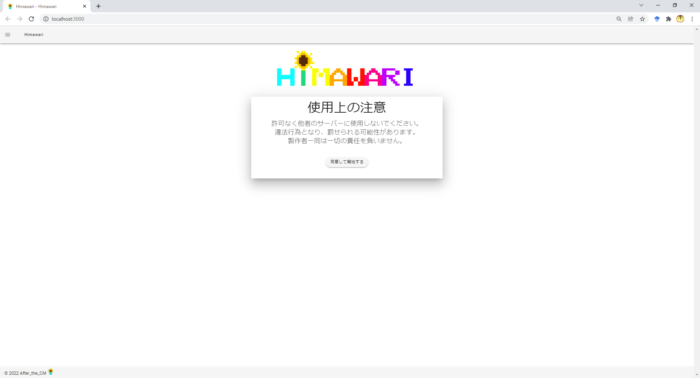

# Tutorial

[Sunflower](https://github.com/After-the-CM/Sunflower)を利用した診断チュートリアルを行います。  

## 環境構築

```txt
git clone git@github.com:After-the-CM/Himawari.git
git clone git@github.com:After-the-CM/Sunflower.git
cd Sunflower/
docker-compose up -d
cd ../Himawari/
bash setup.sh
bash exec.sh
```

## 診断準備

<http://localhost:3000/>にアクセスします。
利用上の規約に同意して診断を開始します。  



以下のように診断対象の情報を入力してください。  

```txt
URL: http://localhost:18080/
LoginフォームがあるURL(Referer): http://localhost:18080/osci/login.php
Loginリクエストの送信先: http://localhost:18080/osci/login.php
Login情報
    メソッド: POST, LoginKey: name, LoginValue: yoden
    メソッド: POST, LoginKey: pass, LoginValue: pass
```


診断対象についての情報が入力できたらCrawlボタンを押してください。  
CrawlerによるSitemapの構築を行います。  

## 診断開始

CrawlerによるSitemapの構築、もしくは`sitemap.json`のImportが完了すればWebUI上でSitemapが表示されます。  


情報を確認して、Start Scanボタンを押してください。診断が開始されます。  

## レポート提示

診断中は随時レポートが更新されます。


現在どのページを診断しているのかを確認したい場合は、以下のコマンドで追いかけることができます。

```txt
tail -f <path/to/Himawari>/api/nohup.out
```

## 診断終了

診断が終了すれば、markdown形式のレポートをダウンロードできるボタンが出現します。


Himawariを起動していたターミナルで`Ctrl + c`を押すことで終了されます。  
Sunflowerは以下のコマンドで停止させてください。

```
cd <path/to/Sunflower>
docker-compose down
```
